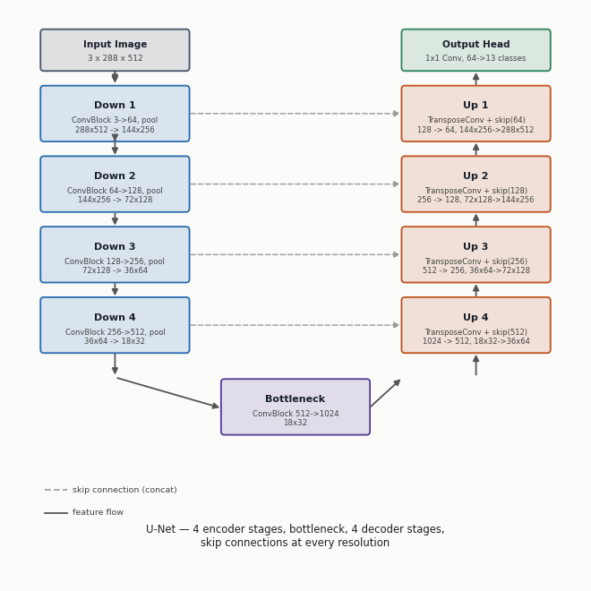
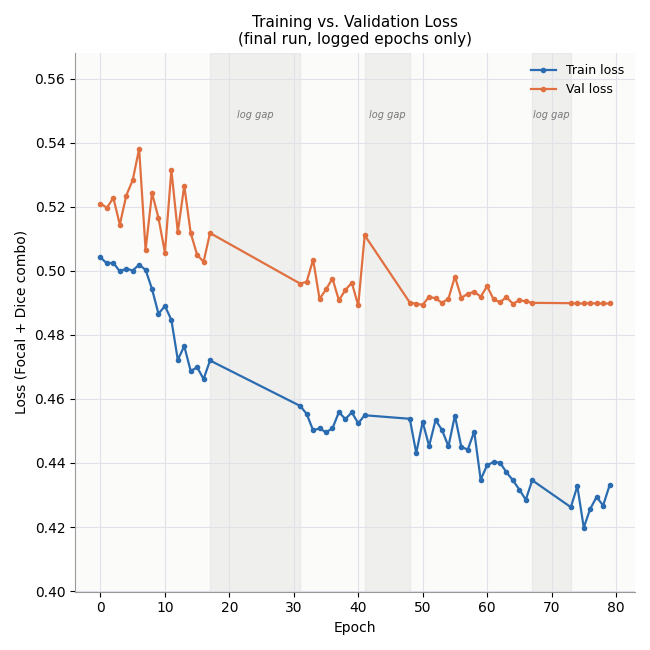
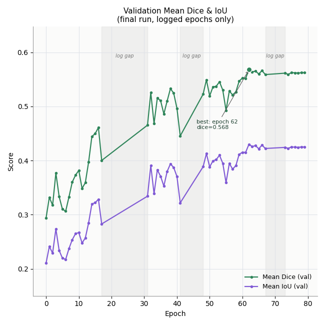
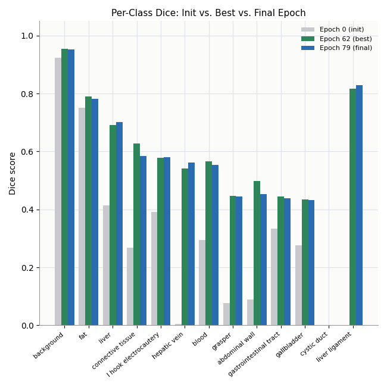

# Surgical Image Segmentation — U-Net on CholecSeg8k

A from-scratch PyTorch U-Net that segments laparoscopic cholecystectomy (gallbladder removal) video frames into 13 anatomical and instrument classes — organs, tissue, blood, and two surgical tools — at the pixel level.

I actually built this to learn and see if it works — I was fascinated by how the decoder part would reform images back up from a heavily compressed representation, and wanted to see that for myself by building one rather than just reading about it. It's not a state-of-the-art result, and I say exactly why in the [Honest Limitations](#honest-limitations) section — but the process is the point of this writeup.

---

## Table of Contents
- [Overview](#overview)
- [Dataset](#dataset)
- [How the Data Was Split](#how-the-data-was-split)
- [Model Architecture](#model-architecture)
- [Training Setup](#training-setup)
- [Results & Analysis](#results--analysis)
- [Honest Limitations](#honest-limitations)
- [Running Inference](#running-inference)
- [Repository Structure](#repository-structure)
- [What I'd Do Differently / Next Steps](#what-id-do-differently--next-steps)

---

## Overview

**Task:** 13-class semantic segmentation of laparoscopic surgery frames — every pixel is classified as background, an organ/tissue type, blood, or one of two surgical instruments.

**Approach:** A 4-level U-Net built from scratch (no pretrained encoder), trained with a combined Focal + Dice loss to fight severe class imbalance, on a custom clip-level train/val/test split of CholecSeg8k.

**Stack:** PyTorch, Albumentations, OpenCV — trained on a free-tier Google Colab GPU, checkpointing to Google Drive so an 80-epoch run could survive being spread across several separate sessions.

**Status:** Trained for 80 scheduled epochs. Common, large structures (background, fat, liver) segment well; several rare classes plateau at a mediocre score, and one — `cystic_duct` — never learned at all. I stopped here on purpose rather than keep tuning around a dataset limitation I'd already diagnosed, and I'm following this up with a transformer-based model on a better-balanced dataset (see [Next Steps](#what-id-do-differently--next-steps)).

---

## Dataset

**[CholecSeg8k](https://www.kaggle.com/datasets/newslab/cholecseg8k)** — semantic segmentation labels built on top of [Cholec80](https://camma.unistra.fr/datasets/), a dataset of 80 laparoscopic cholecystectomy videos recorded at 25 fps and released by CAMMA (University of Strasbourg / IHU Strasbourg / IRCAD).

- **8,080 frames** across **101 short video clips** (80 consecutive frames each), taken from a subset of the underlying Cholec80 videos, at 854×480 resolution.
- Every frame ships with three label images: a hand-annotated color mask (for visualization only), a tool-annotation mask, and a **watershed mask** — the actual training target, which stores each pixel's class ID as a raw integer, replicated identically across all three RGB channels.
- **13 classes:** background, abdominal wall, liver, gastrointestinal tract, fat, grasper, connective tissue, blood, cystic duct, L-hook electrocautery, gallbladder, hepatic vein, liver ligament. Not every class shows up in every frame — several are quite rare.

**Why the watershed mask and not the color mask:** the color mask exists purely so a human can glance at a frame and recognize the anatomy; it's not something a loss function can use directly. The watershed mask, on the other hand, is a genuine categorical label map — one integer class ID per pixel — so it gets remapped through a 256-entry lookup table into a clean `(H, W)` array of class indices `0–12` before being handed to the model. Cross-entropy-style losses need per-pixel integer labels, not RGB colors, so this remapping step is what actually makes the mask usable as a training target.

**Figuring out the class ID mapping was its own small project.** The raw integer values used in the watershed masks aren't spelled out anywhere in the dataset's documentation in a way that maps cleanly onto the 13 class names, so working out which raw value corresponded to which class took real trial and error — cross-referencing against the color masks, and in a few cases just visually confirming a raw value against the actual anatomy frame by frame. The final mapping is graded by how confident I actually am in it:
- **High confidence** (cross-referenced against the color mask): background, abdominal wall, liver, fat, GI tract, grasper, blood.
- **Corrected via direct visual confirmation**, after an earlier attempt got them wrong: gallbladder, liver ligament, connective tissue, hepatic vein.
- **Inferred, not fully confirmed** (based on which raw values plausibly correspond to a small instrument vs. a large organ by pixel area): cystic duct, L-hook electrocautery. I'd flag these two as worth double-checking before trusting this model on them in anything remotely real.

---

## How the Data Was Split

This ended up being the single hardest part of the project, harder than the architecture itself, so it gets its own section.

**First attempt — split by whole video.** The obvious approach: assign entire source videos to train/val/test so no frames from the same video leak across splits. This immediately broke: several of the 13 classes only appear in one or two of the 17 available source videos, so a whole-video split meant some classes vanished from a split entirely by bad luck. Concretely, this attempt produced **zero training frames for `liver_ligament`** and **zero validation frames for `connective_tissue`, `blood`, and `hepatic_vein`** — those classes physically could not be learned or evaluated, no matter what the model or loss function did.

**The fix — split by clip, not by video, with class-coverage guarantees.** Each source video is itself made up of multiple 80-frame clips, and clips are a much finer-grained unit than whole videos — fine enough to deliberately balance rare classes across splits while whole videos weren't. The final splitting strategy:

1. Scan every clip and record exactly which of the 13 classes appear in it (reading every frame's mask, not a subsample, since missing a rare class by subsampling would defeat the whole point).
2. Rank classes from rarest to most common. For each one, in that order, reserve at least one clip containing it for **train**, and — if a second distinct clip containing it exists anywhere in the dataset — reserve one for **val** too.
3. Everything left over is shuffled and distributed to hit a target ~70/15/15 frame-count ratio across train/val/test.
4. All frames within a single clip always stay together in the same split — consecutive frames at 25fps are near-duplicates, so splitting a clip across train and val would leak information and make validation numbers meaninglessly optimistic.

This guarantees every class that has *any* real presence in the dataset gets at least some training coverage, and validation coverage wherever the raw footage has enough distinct clips containing it to make that possible at all. It doesn't fix classes that are just fundamentally rare in the source footage — no re-splitting trick can conjure frames that don't exist — but it stops the split itself from making the imbalance worse than it has to be.

**On top of the split**, per-class pixel-frequency weights (computed from the training split only) are fed into both the Dice and Focal loss terms, so a rare class like `hepatic_vein` (weighted roughly 10×) contributes proportionally more to the gradient than its raw pixel count alone would ever earn it.

**Other data-pipeline details:** frames are sub-sampled temporally (every 2nd frame for train, every 4th for val/test, to cut down on near-duplicate consecutive frames), resized to 512×288, and augmented with flips, affine shift/scale/rotate, and standard photometric jitter during training. A custom batch sampler also makes sure each training batch pulls from several different source videos rather than a run of consecutive, highly-correlated frames from just one clip.

---

## Model Architecture

A standard 4-level **U-Net**, implemented from scratch in PyTorch — no pretrained encoder backbone.

<p align="center">
  
</p>

<!-- 🖼️ Optional: if you'd rather swap in a hand-drawn flowchart image instead, drop it in
     assets/images/ and update the src path above. -->

**Input:** `(N, 3, 288, 512)` RGB image
**Output:** `(N, 13, 288, 512)` raw per-pixel class logits (softmax/argmax is applied afterward, not inside the model)

**Building block — `ConvBlock`:** two repetitions of `Conv2d(3×3, padding 1, no bias) → GroupNorm(8 groups) → LeakyReLU(0.1)`. GroupNorm was used instead of BatchNorm because it stays stable at the small batch sizes this had to run at on a free Colab GPU; LeakyReLU avoids the dead-neuron issues plain ReLU can run into when paired with GroupNorm.

**Encoder (downsampling path)** — each stage is one `ConvBlock` followed by 2×2 max pooling, keeping the pre-pool feature map around as a skip connection for later:

| Stage | In → Out channels | Spatial size after pooling |
|---|---|---|
| Down 1 | 3 → 64 | 144 × 256 |
| Down 2 | 64 → 128 | 72 × 128 |
| Down 3 | 128 → 256 | 36 × 64 |
| Down 4 | 256 → 512 | 18 × 32 |

**Bottleneck:** one `ConvBlock`, 512 → **1024** channels, at 18×32 resolution — the deepest, most compressed point in the network.

**Decoder (upsampling path)** — each stage upsamples with a `ConvTranspose2d(2×2, stride 2)`, concatenates the matching encoder skip connection along the channel axis, then runs a `ConvBlock` to fuse the two:

| Stage | Upsample in | + Skip from | Fused channels | Out channels |
|---|---|---|---|---|
| Up 4 | 1024 | 512 (Down 4) | 1024 | 512 |
| Up 3 | 512 | 256 (Down 3) | 512 | 256 |
| Up 2 | 256 | 128 (Down 2) | 256 | 128 |
| Up 1 | 128 | 64 (Down 1) | 128 | 64 |

One small robustness detail worth mentioning: if a transposed-conv output's spatial size doesn't land exactly on its skip connection's size (which can happen with odd input dimensions), it gets bilinearly resized to match before concatenation, rather than crashing or quietly misaligning features.

**Output head:** a final `1×1 Conv2d`, 64 → 13 channels, turning the last decoder features directly into per-class logits at full input resolution.

Overall, the encoder compresses a 288×512 image down to 18×32 — a 16× spatial reduction — while expanding to 1024 channels, and the decoder mirrors that back up to full resolution, with skip connections at every scale so fine spatial detail lost to pooling gets recovered rather than blurred away.

---

## Training Setup

| Hyperparameter | Value |
|---|---|
| Learning rate | 1e-3, cosine annealed over the full run |
| Weight decay | 1e-4 |
| Batch size | 8 |
| Scheduled epochs | 80 |
| Loss | 0.5 × Focal (γ=2.0) + 0.5 × Dice, both per-class weighted |
| Input size | 512 × 288 |
| Hardware | Google Colab, free-tier GPU |

---

## Results & Analysis

Validation metrics were logged for **56 of the 80 scheduled epochs** — a few ranges of epochs are missing simply because a Colab session disconnected before that portion of the console log got saved to Drive. Training itself continued through those gaps thanks to the checkpoint/resume setup above; only the printed logs for a few stretches were lost. Every number and chart below uses **real logged values only** — nothing here is interpolated or invented to paper over the gaps.

<p align="center">
  
</p>

Training loss fell steadily from ~0.50 to ~0.42–0.43 across the run. Validation loss dropped alongside it early on, then flattened around ~0.489–0.490 for the last several logged epochs — a real plateau, not a logging artifact, suggesting the run had converged to about what this architecture/dataset/loss combination was going to give.

<p align="center">
  
</p>

- **Epoch 0** (random init): mean Dice **0.294**, mean IoU **0.211**
- **Best logged epoch — epoch 62**: mean Dice **0.568**, mean IoU **0.430**
- **Final logged epoch — epoch 79**: mean Dice **0.563**, mean IoU **0.425**

Most of the improvement happened in two visible jumps: one right after the first big gap (once the earlier split/loss-weighting fixes were fully in effect), and a second, gentler climb through the 50s and 60s, before flattening out in the final stretch.

<p align="center">
  
</p>

The model does well on large, visually distinct, common structures — background, fat, liver — and does surprisingly well on `hepatic_vein` and `connective_tissue` given how rare they are, which suggests the per-class loss weighting is genuinely earning its keep there. `cystic_duct` is the clear outlier: a Dice score of exactly 0.000 at every logged epoch of the entire run. That gets its own discussion below.

---

## Honest Limitations

I'm including this section on purpose — how a project actually went is more useful to a reader than a version that pretends it went perfectly.

- **`cystic_duct` never learned anything, at all.** Its Dice score is exactly 0.0000 across every logged epoch, from initialization through the final one. This is almost certainly a dataset issue rather than a modeling one: it's one of the rarest classes among the frames that contain it at all, and — as flagged in the mapping section above — its raw-value-to-class mapping was only inferred by plausibility, never visually confirmed, so there's a real chance part of its remaining signal is also just mislabeled.
- **Several other rare or thin structures plateaued in the 0.43–0.45 Dice range** — grasper, gallbladder, abdominal wall, GI tract. Usable, but not strong. These tend to be either thin/small in the frame (the instruments) or highly variable in appearance depending on what's occluding them at any given surgical moment.
- **I made a deliberate call to stop here.** Once it was clear the ceiling was mostly about class imbalance in the source data rather than something more epochs or more loss-tuning would meaningfully fix, I stopped rather than keep iterating on the same U-Net/dataset combination.
- **Training was genuinely noisy and gappy**, because it was spread across several separate Colab sessions rather than run in one sitting — the 56/80 logged epochs above are the real numbers, not filler.

---

## Running Inference

No GPU or training setup required for this part — just Python and the four steps below. This assumes basic comfort with a terminal, but nothing beyond that.

### 1. Clone the repository
```bash
git clone https://github.com/Vihaan30g/surgical-image-segmentation.git
cd surgical-image-segmentation
```

### 2. Install the dependencies
Python 3.9+ recommended.
```bash
pip install -r requirements.txt
```

### 3. Download the trained weights
Download the model from this Google Drive link:

**[Download model weights](https://drive.google.com/file/d/130ePIeZ6A0F6N0XUNNUB8poQS7DbMN7B/view?usp=sharing)**

Place the downloaded file inside the `weights/` folder at the root of the cloned repo, so it looks like this:
```
surgical-image-segmentation/
└── weights/
    └── best_model.pth      <-- put it here
```

### 4. Add images to run inference on
Drop any `.jpg`, `.jpeg`, or `.png` surgical frames you want segmented into the `inference_input/` folder at the repo root:
```
surgical-image-segmentation/
└── inference_input/
    ├── my_frame_1.jpg
    ├── my_frame_2.png
    └── ...
```

### 5. Run inference
```bash
cd src
python inference.py
```

That's the whole workflow — no arguments or flags needed. The script automatically finds the weights, finds every image in `inference_input/`, and processes all of them in one go.

### 6. Check the results
Results are written to `inference_output/` at the repo root, one file per input image, named `<original_filename>_prediction.png`. Each output image is a single wide image with three panels side by side:

**`[ original frame | predicted segmentation mask | overlay on the original ]`**

```
surgical-image-segmentation/
└── inference_output/
    ├── my_frame_1_prediction.png
    ├── my_frame_2_prediction.png
    └── ...
```

No extra setup, config edits, or path changes are needed for any of this — the folder layout above is exactly what the code expects out of the box.

---

## Repository Structure

```
surgical-image-segmentation/
├── weights/                     # Put downloaded best_model.pth here
├── inference_input/             # Put your own images here to run inference
├── inference_output/            # Inference results are written here automatically
├── assets/
│   └── images/                  # Diagrams and charts used in this README
├── src/
│   ├── config.py                # Central config: paths, class mapping, hyperparameters
│   ├── dataset.py                # CholecSegDataset, mask remapping, augmentations, sampler
│   ├── generate_clip_split.py    # Builds the clip-level train/val/test split
│   ├── compute_class_weights.py  # Computes per-class inverse-frequency loss weights
│   ├── model.py                  # U-Net architecture
│   ├── losses.py                 # Focal Loss, Dice Loss, combined loss
│   ├── metrics.py                # Dice / IoU metrics
│   ├── train.py                  # Training loop, checkpointing, auto-resume logic
│   ├── inference.py               # Run the trained model on your own images
│   └── diagnose.py                # Debugging utilities used during development
├── requirements.txt
└── README.md
```

**Dataset:** [CholecSeg8k on Kaggle](https://www.kaggle.com/datasets/newslab/cholecseg8k)

---

## What I'd Do Differently / Next Steps

- The dataset is the real ceiling here, not the architecture — several classes are only represented in a handful of the source videos, and no amount of loss re-weighting fully compensates for that.
- I'm planning a follow-up segmentation project using a **transformer-based architecture** (something in the SegFormer/Mask2Former family) on a **better-balanced dataset**.
